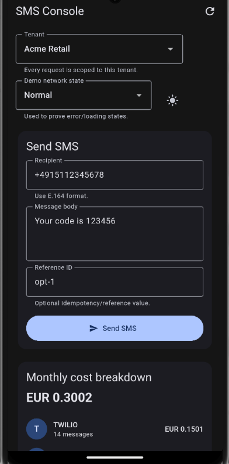
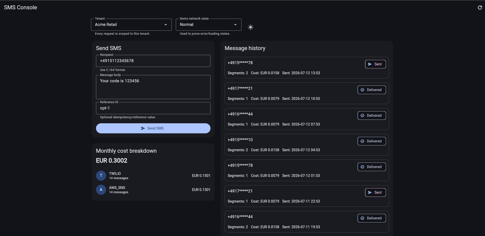

# Studio Butterfly SMS Console

A rebuild of the supplied SMS console focused on correctness, tenant isolation, explicit async state, and a UI that works on phone and desktop widths.

## Run the project

### Prerequisites

- Flutter SDK on the stable channel
- A configured Android/iOS emulator, physical device, or desktop/web target

The submission was developed and verified using Flutter 3.41.9 and Dart 3.11.5. GitHub Actions uses the same pinned Flutter version to reduce differences between local and CI test results.

### Default: fake backend

The fake backend is enabled by default, so no server or real credentials are required.

```bash
flutter pub get
flutter run
```

The screen includes a **Demo network state** selector for normal, slow, offline, `429`, `502`, expired-token, and empty-data scenarios.

### Exercise the real HTTP implementation

```bash
flutter run \
  --dart-define=USE_FAKE_BACKEND=false \
  --dart-define=API_BASE_URL=https://your-api.example.com \
  --dart-define=ACCESS_TOKEN=your-short-lived-token
```

This path is wired through Dio but was not validated against the company's live backend in this submission. The demo tenant IDs in the app are local values; if you connect to a real service, replace them with tenant IDs authorized for the supplied token.

On PowerShell, run the command on one line or use PowerShell backticks instead of `\`.

### Configuration

| Value | Default | Purpose |
|---|---|---|
| `USE_FAKE_BACKEND` | `true` | Selects `FakeSmsApi` or `RealSmsApi` through dependency injection. |
| `API_BASE_URL` | `https://api.example.invalid` | Base URL used by Dio when the real backend is enabled. |
| `ACCESS_TOKEN` | `demo-access-token` | Adds the bearer token to real API requests. This is a take-home convenience, not a secure token store. |

These values use Dart compile-time environment values through `String.fromEnvironment` and `--dart-define`. **Build runner is not used for configuration.** `--dart-define` values are compiled into the application and must not be treated as production secrets. A production app should obtain short-lived tokens from authentication and store them with platform-secure storage.

## Useful commands

```bash
flutter analyze
flutter test
flutter run -d chrome
flutter devices
```

Golden files should only be updated after intentionally reviewing the visual change:

```bash
flutter test --update-goldens
```

## What I changed and why

### Architecture

I replaced the single-file implementation with a feature-first structure:

```text
lib/
├── app/
├── core/
└── features/
    ├── sms/
    │   ├── data/
    │   ├── domain/
    │   └── presentation/
    └── tenant/
```

The structure follows the requirements first and keeps transport, domain, and presentation concerns separate without adding extra layers that did not improve the shipped flows.

The abstract `SmsRepository` describes domain-facing operations, while `SmsRepositoryImpl`, DTOs, and API implementations remain in the data layer. This keeps transport details such as JSON, Dio, and fake responses outside domain models.

### State management

The early implementation used multiple `StateProvider`-style pieces of state. That was acceptable for simple values but became difficult to coordinate for initial loading, sending, refreshing, pagination, retries, and partial failures.

I moved the SMS screen to `AsyncNotifierProvider.family` and kept the simple selected tenant ID in a `NotifierProvider`. The family key is the tenant ID string, so each tenant has an explicit state scope without custom equality boilerplate.

See [ADR 0001](docs/adr/0001-riverpod-async-state-and-tenant-scoping.md).

### Tenant isolation

The contract requires `X-Tenant-Id`, but no tenant-discovery response was defined. I therefore used two local demo tenants and matching seeded fake data.

The tenant ID follows one visible chain:

```text
Tenant selector
→ selectedTenantIdProvider
→ smsConsoleControllerProvider(tenantId)
→ SmsRepository
→ SmsApi
→ fake tenant map or Dio X-Tenant-Id header
```

Every send, cost, refresh, and paginated history request requires the tenant ID. Switching tenants therefore selects a separate controller state and a separate fake-data bucket.

### Networking and failure handling

The starter used `package:http`. I introduced a small Dio-based client to centralize:

- connection, send, and receive timeouts;
- authorization and tenant headers;
- typed error mapping;
- `429 Retry-After`, `401`, `403`, and `502` handling.

`SmsApi` has fake and real implementations selected through Riverpod. The fake implementation reproduces slow, offline, rate-limited, provider-down, expired-session, and empty states without requiring the company backend.

### Money

SMS prices use four decimal places, so binary floating point is not suitable for billing calculations. Money is represented with a scaled `BigInt`; for example, `0.0079 × 3` is exactly `0.0237`.

For the real API, backend-returned decimal cost strings are treated as the source of truth. The client does not invent production pricing rules that are absent from the contract.

### Validation

Form-specific input checks were moved from `SendSmsInput` into Flutter's `Form` and `TextFormField.validator` flow. `SendSmsInput` remains a plain domain input model, while the presentation layer owns required-field, E.164, and form-length feedback.

The backend remains the final authority for validation in a production system.

### Customer-facing UI

- light and dark themes are defined centrally;
- send form, cost breakdown, history list, status chip, and common state views are reusable components;
- loading, empty, success, and recoverable error states are explicit;
- the layout changes from a vertical phone flow to a two-column desktop layout;
- buttons and interactive elements include practical sizing and semantic labels.

## Assumptions made because the contract was ambiguous

I identified the following ambiguities and proceeded with documented assumptions so the implementation could stay within the time-box:

- **Tenant discovery:** local demo tenants are acceptable because no discovery/login response was defined.
- **Pricing:** API-returned costs are authoritative; no production price table is invented.
- **Delivery updates:** status is refreshed through message-history reloads because no websocket or single-message polling endpoint was provided.
- **Expired tokens:** the UI exposes a session-expired state; a full refresh flow is not implemented because its payload was not specified.
- **Monthly range:** UTC calendar-month boundaries are used consistently.
- **Bulk send:** excluded because the required shipped flow is single-message sending.

## Tests and CI

Current automated tests:

- `test/unit_test.dart` covers exact money arithmetic, repository DTO-to-domain mapping, tenant forwarding, and fake API error behavior (offline and `429 Retry-After`).
- `test/widget_test.dart` covers form validation blocking invalid sends, successful send flow with tenant-scoped refresh, and recoverable offline error UX.
- `test/golden/cost_breakdown_card_golden_test.dart` protects the stable cost-summary layout and four-decimal money display.

Run the full suite:

```bash
flutter test
```

Run only unit tests:

```bash
flutter test test/unit_test.dart
```

Run only widget tests:

```bash
flutter test test/widget_test.dart
```

Run the golden baseline update only after intentionally reviewing the visual change:

```bash
flutter test test/golden/cost_breakdown_card_golden_test.dart --update-goldens
```

### GitHub Actions setup

The CI workflow file is stored at:

- `.github/workflows/flutter-ci.yml`

This workflow runs on:

- push to `main`;
- pull request open/update;
- manual trigger from the **Actions** tab (`workflow_dispatch`).

It executes:

- `flutter pub get`
- `flutter analyze`
- `flutter test`

GitHub Actions job summary:

```text
flutter analyze
flutter test
```

## Platform notes

The adaptive layout uses the available width rather than stretching the phone layout. Screenshots from the two layout breakpoints are included in `docs/screenshots/`:

- `docs/screenshots/Phone_view.png` for the mobile-width layout around 360 px;
- `docs/screenshots/PC_View.png` for the desktop-width layout around 1400 px.

Preview:




The main cross-platform risks I would still verify on real targets are keyboard focus, text selection, mouse-wheel scrolling, resize behavior, platform font differences, and mobile keyboard insets.

## Known limitations

- The real HTTP path is wired but not validated against a live company backend.
- Token refresh was not implemented because the refresh payload was not defined.
- Tenant discovery remains local/demo only.
- Pending delivery status is refreshed manually through history reloads rather than automatic polling or server push.
- The fake history data does not filter by month boundaries.
- Full screen-reader and large-text accessibility testing was not completed.
- Theme choice is not persisted.
- The demo network-state controls are intended for the fake backend only.

## What I would do with another week

- Integrate the real backend and add contract/integration tests around Dio.
- Implement authentication, token refresh, logout, and secure token storage.
- Replace local tenant discovery with authenticated tenant data.
- Add broader widget, accessibility, and multi-platform test coverage.
- Add a deliberate delivery-status polling/backoff policy or server-push integration once the backend mechanism is defined.
- Move all dependency wiring into a dedicated `app/di` module if the codebase grows.

## Deliberately not done

- Bulk SMS.
- A guessed token-refresh request or response model.
- A guessed tenant-discovery API.
- Local offline sending or message persistence.
- Invented production pricing.
- Shipping a real access token in source code or repository files.
- Adding extra architecture layers that did not improve the required flows within the 6–8 hour time-box.
